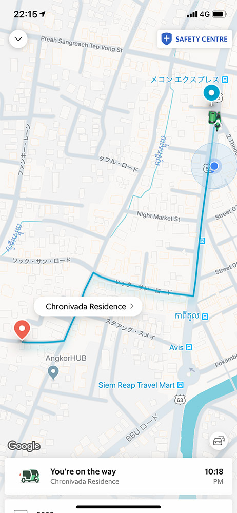

シェムリアップ国際空港にて入国手続き。

カンボジアに入国するためにはビザが必要。空港内で直接申請することもできるし、事前に E-Visa で申請しておくこともできる。

> e.visa | Kingdom of Cambodia  
> https://www.evisa.gov.kh/ 

私は事前に E-Visa で申請しておいたのでプリントアウトした Visa を持って直接入国審査へ。強面の入国審査官は意外にも日本語で対応してくれた。入国審査では指紋を採取されるのだが「両手指8本」と言われて親指以外の8本を、「両手親指」と言われて親指2本を採取された。

特に問題なく入国を済ませ荷物を受け取って空港の出口へ。空港を出ると、ホテルから旅行者を迎えにきたドライバーが20,30人程待機していた。実は送迎に来てもらうのは初めてでうまく落ち合えるか不安だったのだが、自分の名前の書かれた紙を持っている人はすぐに見つかった。

自分の名前の書かれた紙を持っていたのは気の良さそうなおじさんだった。紙に書かれた名前が自分であることを告げると、挨拶と握手を交わしておじさんが乗ってきたトゥクトゥクまで移動。途中で「何歳？ホントに？もっと若く見えるんだけど」なんて会話をしながら向かった。おじさんは50歳とのことだったが、すごく元気で明るくておじさんこそ若く見えた。

早速おじさんのトゥクトゥクに乗って宿泊先の [Secondfold Residence](https://www.booking.com/hotel/kh/anachak-boutique.ja.html) に移動。

出発直前に少し雨が振り始めたがトゥクトゥクには屋根があるので濡れずに済む。おじさんはわりと安全運転だったものの、トゥクトゥクの前と横は開いているので外の風を直接感じることができる。乗っている間に本当に現地に到着したんだなぁという実感が一気に湧いた。

15分程移動して20:00頃にホテルに到着。無事にチェックインを済ませ部屋に通されると、想像していたよりもキレイな部屋だった。

ホテルの従業員の方も対応が丁寧で感じが良かった。

移動中に何も食べなかったこともあってお腹が空いたが、少し休憩している間に外は土砂降りになっていた。移動に疲れていたのでシャワーを浴びて寝たい気持ちもあったが、さすがに何も食べずに寝るのは辛い。丁度 [Grab](https://www.grab.com/) でトゥクトゥクを呼んでみる良い機会なのでさっと買い出しに出かけることにした。

土砂降りの雨でも呼んだらすぐに来てくれるのかなぁと思いつつ [Grab App](https://apps.apple.com/jp/app/grab-app/id647268330) で呼んでみると、ものの30秒くらいでホテルの前まで迎えに来てくれた。

行き先もアプリ上で指定済みなので簡単な挨拶でもしたら後は乗っておくだけ。超簡単。ホテルから数分の場所ではあるものの、料金はたったの1ドルだった。アプリにクレジットカードを登録しておけば降りる際に支払いも必要ない。

到着した場所は Asia Market Supemarket というスーパー。食料品から日用品まで揃っていて使い勝手がいい。特にお酒の品揃えが充実していた。

パンや水、ビールなどひとまず今夜を凌げる最低限の物だけを購入。帰りも同じように Grab でトゥクトゥクを呼んで1ドルでホテルに戻る。 Grab 超便利。

無事にホテルに戻ってシャワーを浴び、明日の計画を練ってから早めに就寝することに。
