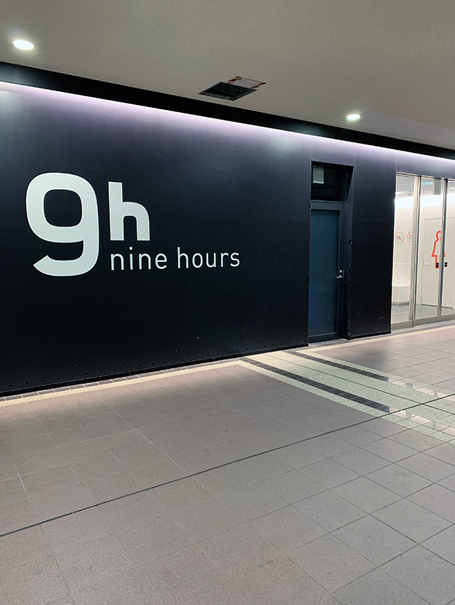
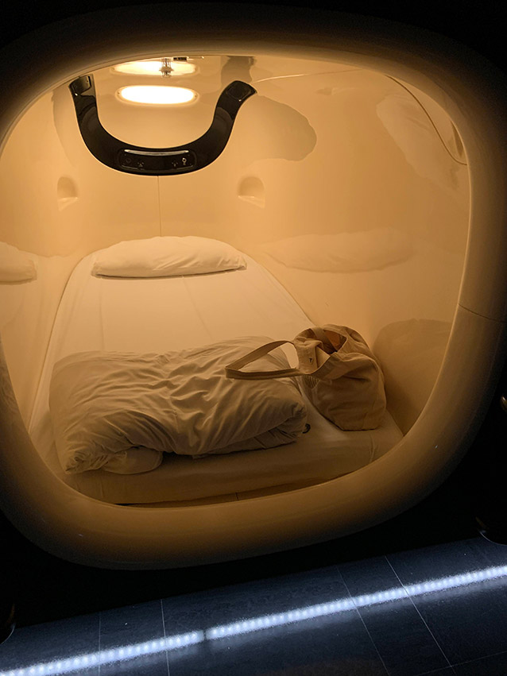
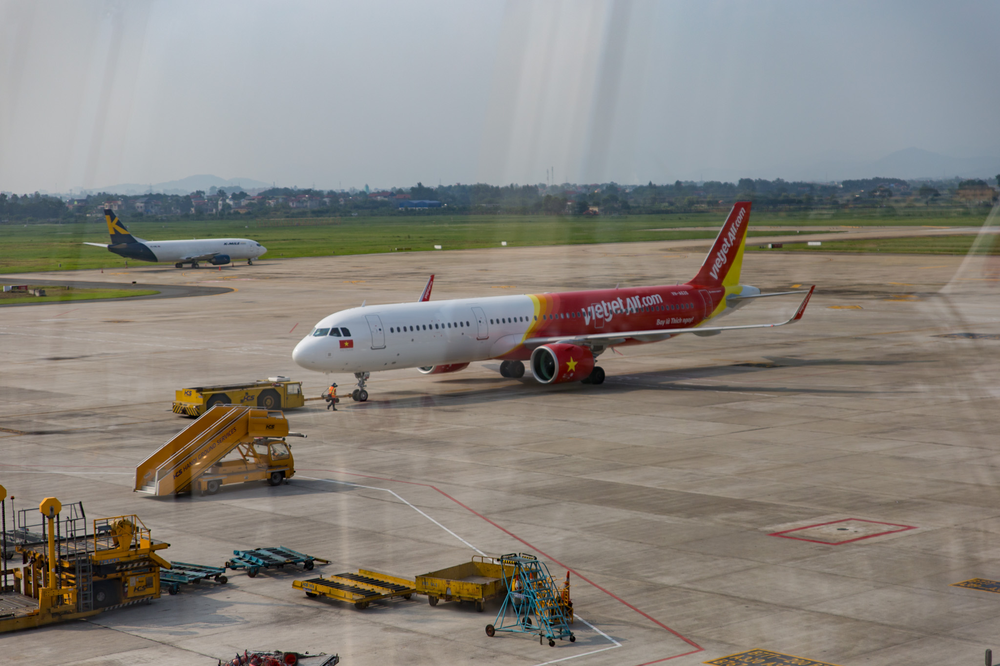
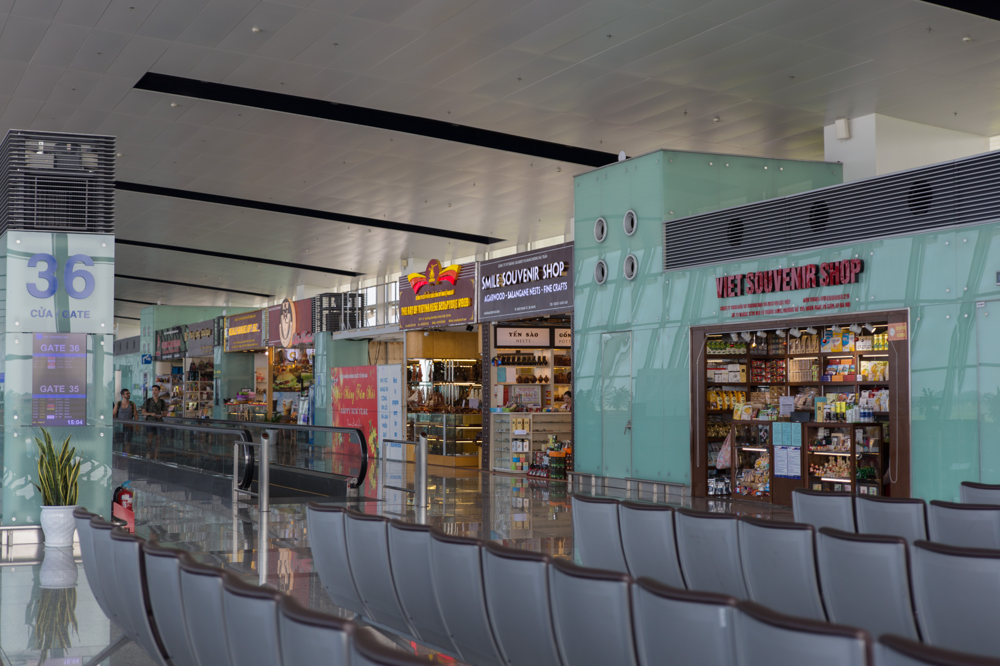
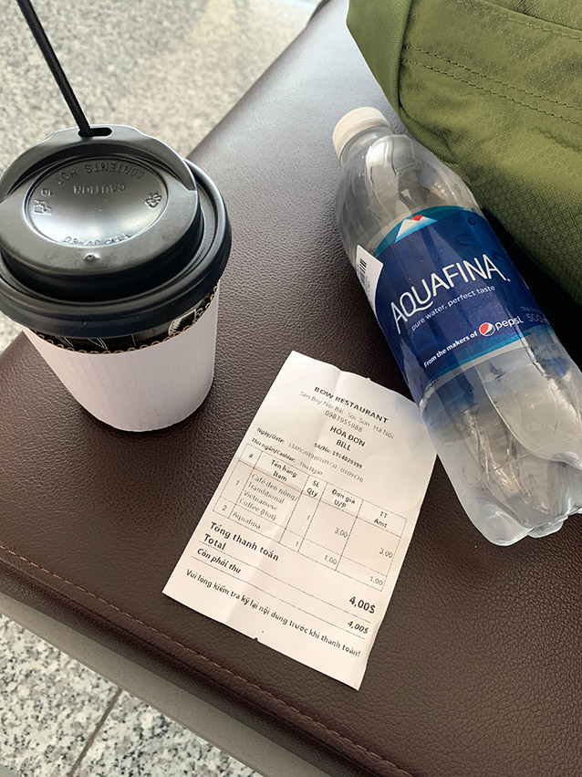
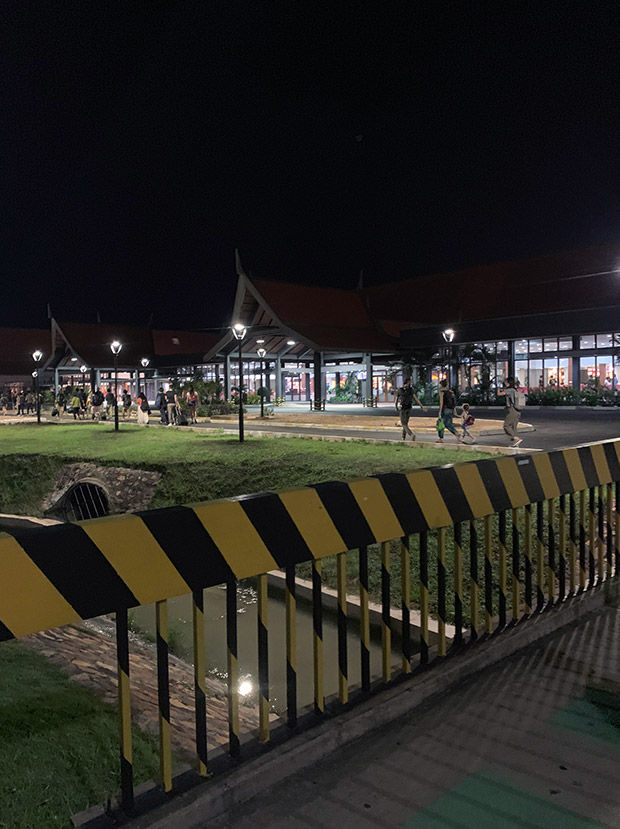

シェムリアップへは成田からハノイを経由して向かう。成田発の便は 9:30 発で諸々手続きする時間を考慮すると朝移動するには時間的に厳しい。なので成田空港第2ターミナルに隣接の [nine hours](https://ninehours.co.jp/narita/) というカプセルホテルに前泊することにした。予約は[トラベルコ](https://www.tour.ne.jp/)からの [Agoda](https://www.agoda.com/ja-jp) 経由で約3,600円。

これまでカプセルホテルに泊まったことがなかったのでやや不安な気持ちで宿泊。

カプセル内もシャワールームもWebサイトの写真ほどはキレイじゃないにしても許容範囲な程度。カプセルが立ち並ぶ通路は少し未来感があった。わりと満室に近い状態だったようだけど騒音も特に気にならなかったし、朝出発する前にはもう一回シャワー浴びることができて便利だし、朝早い便で移動するならまた使ってもいいかな。

朝 7:00 頃にチェックアウトして淡々と出国の手続きをして出発の時間までカフェで時間を潰し、時間どおり飛行機に乗り込む。乗ったのは [VietJet Air](https://www.vietjetair.com) VJ933 便。まずは5時間半かけてベトナムのノイバイ国際空港へ。

概ね定刻どおり現地時間の13:05頃にノイバイ国際空港に到着。日本との時差は-2時間。

無事にトランスファーカウンターを抜けて3時間程待機。空港でコーヒーを買って飲みながら時間を潰して、次の VJ913 便へ乗り換え。

ハノイからシェムリアップへのフライトは1時間半程度。少し出発が遅れてしまい、ホテルに送迎を依頼していた時間に遅れてしまいそうだったのでその旨連絡を入れた。すると15分程ですぐに返信があり、このホテルの対応しっかりしているなぁと好感を持った。

シェムリアップ国際空港に到着したのは45分程遅れて19:05頃。外はもうすっかり暗くなっていた。

