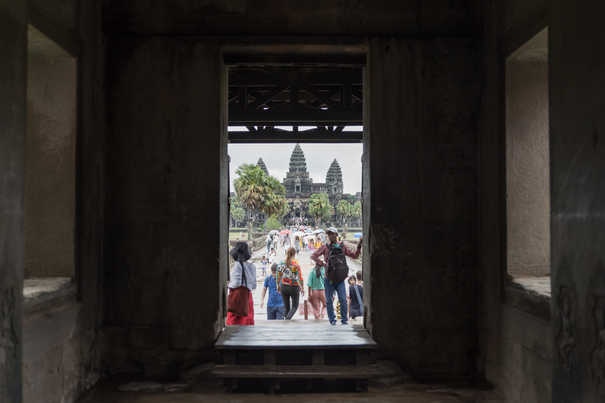
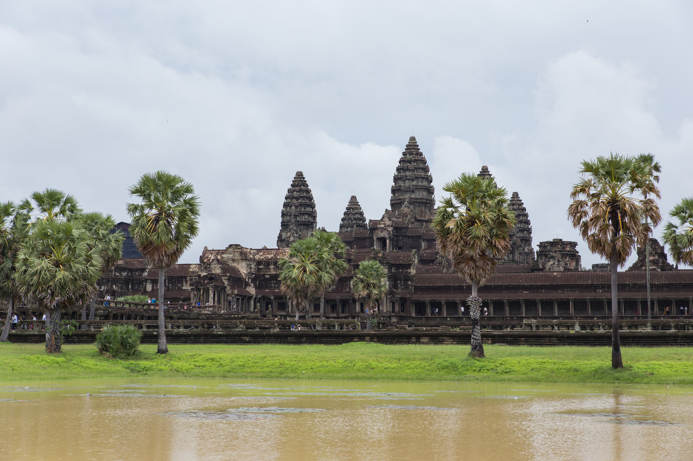
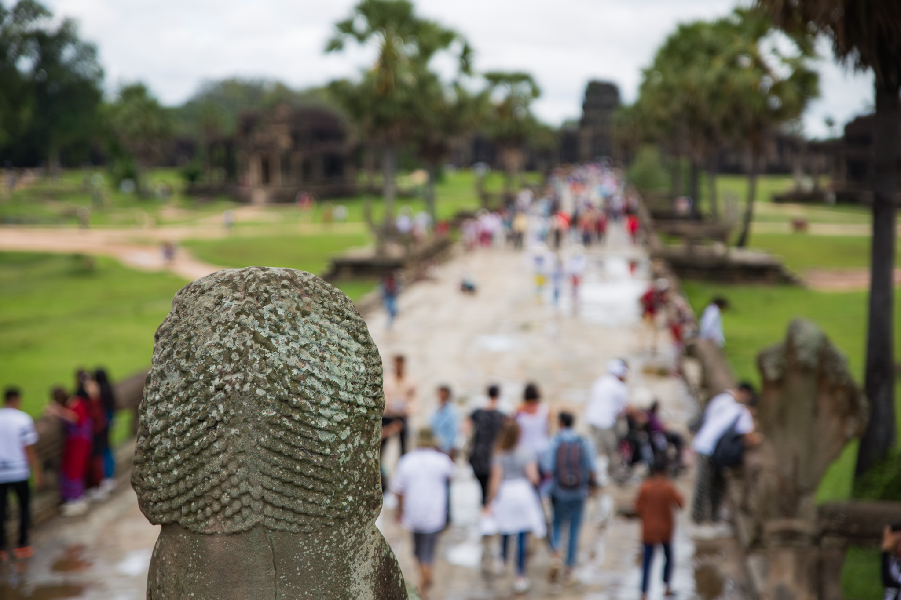
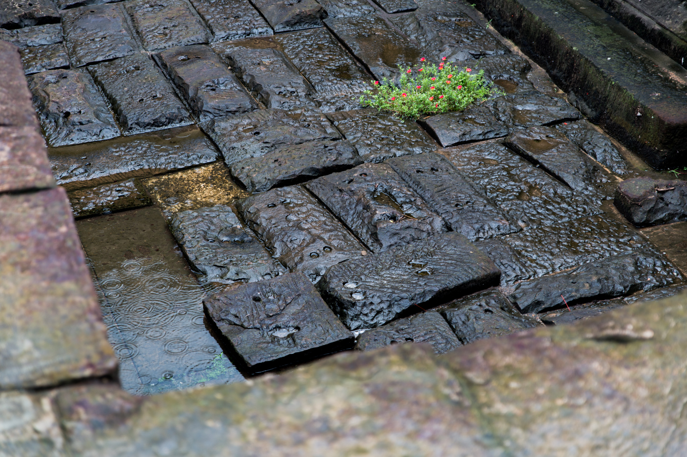
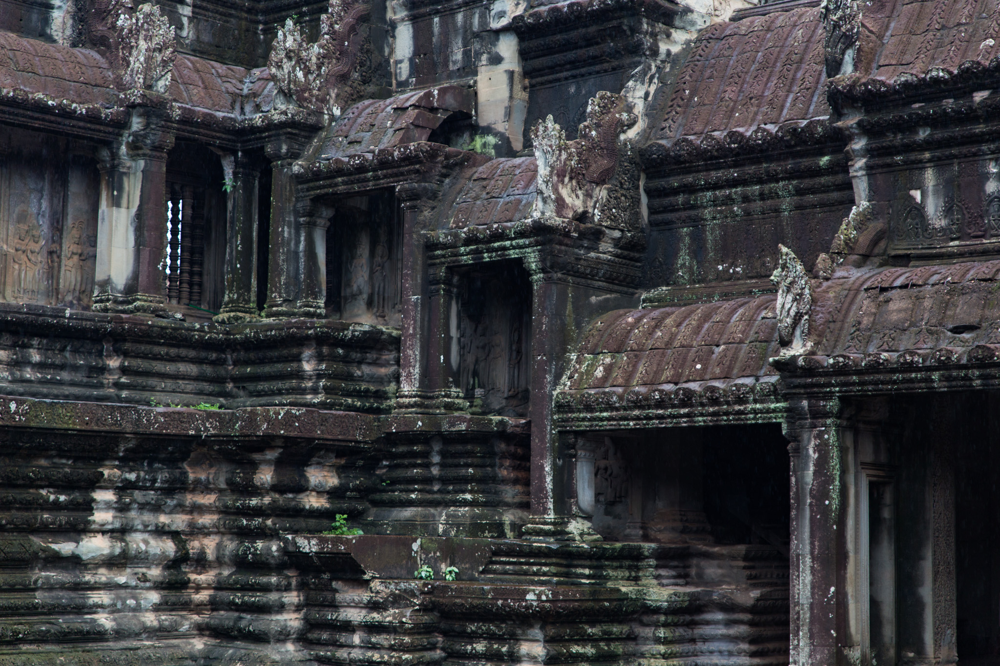
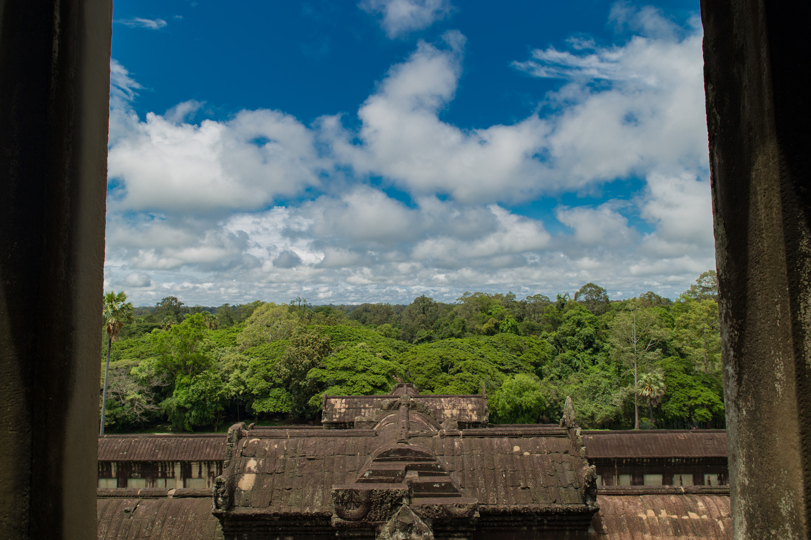
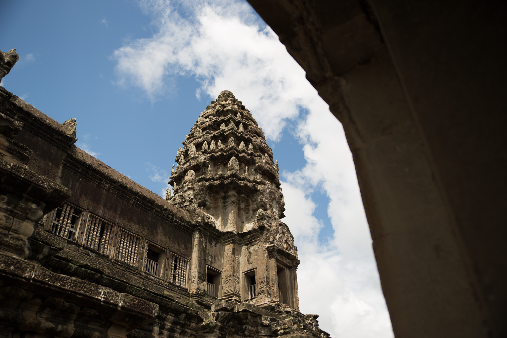
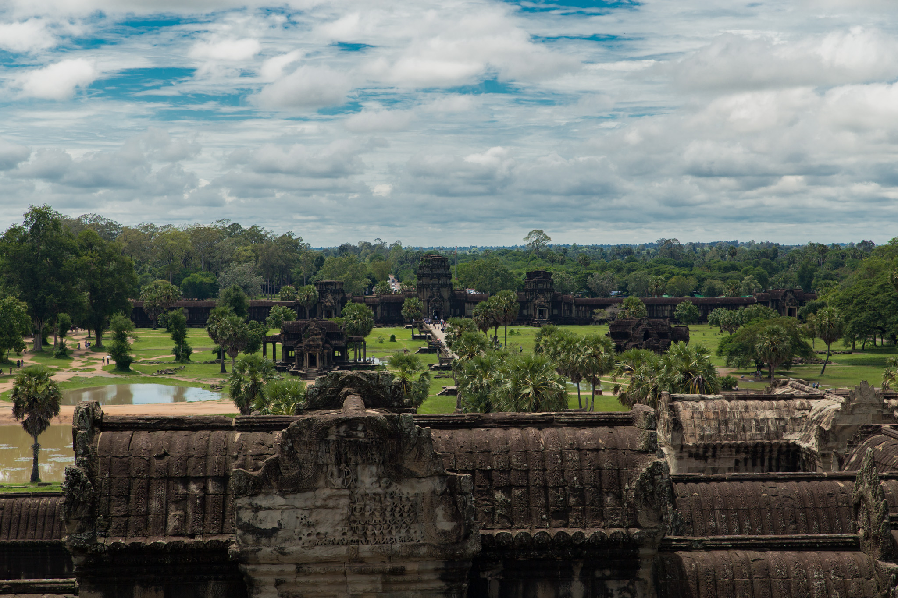
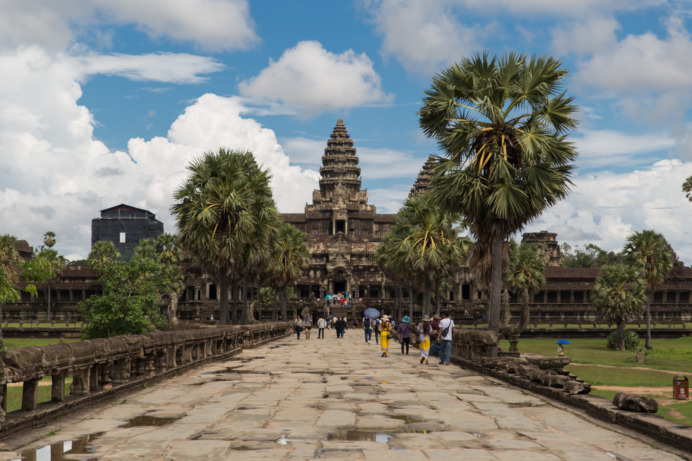

チケットセンターで Grab を使ってトゥクトゥクを呼んでアンコールワットへ。チケットセンターでは流しのトゥクトゥクにしつこく客引きされたがスルーした。あれだけ強く客引きされたらボッタクられるのではないかと逆に怖くなる。その点 Grab を使えば事前に料金を確認できるので安心感があって良い。

小雨の降る中アンコールワットに到着。

ギリギリ傘をささなくてもいいくらいの雨。

雨降っているし、もしかして観光客は少なめかな？と想像していたが全然そんなことはなかった。池がものすごく濁って見えるがこれは雨のせいなのだろうか。ネット上では寺院を池に反射させた写真をよく見かけたのだが、これだけ濁っていては反射させるのは難しそう。

暫く写真を撮っているとある男女から英語で「写真撮ってもらえませんか？」と声を掛けられた。快く OK して写真を撮ってあげると、男性が「どこから来たんですか？」と聞いてきた。日本から来たことを伝えると女性の方が「おー日本大好きです」って言ってきた。聞くと台湾の方らしい。台湾といえば今同居人が向かっているはず。不思議な縁を感じつつ、「旅を楽しんで」と伝えて別れた。

寺院の奥へと進んでいくといつの間にかに天気は晴れになっていた。カンボジアの天気は変わりやすい。

気が付くとアンコールワットに来てから既に2時間半ほど経っていた。晴れてきたし他のスポットも回りたい。アンコールワットへは朝日を撮るためにもう一度訪れるつもりでもあるので、次の場所へ向かうことに。
