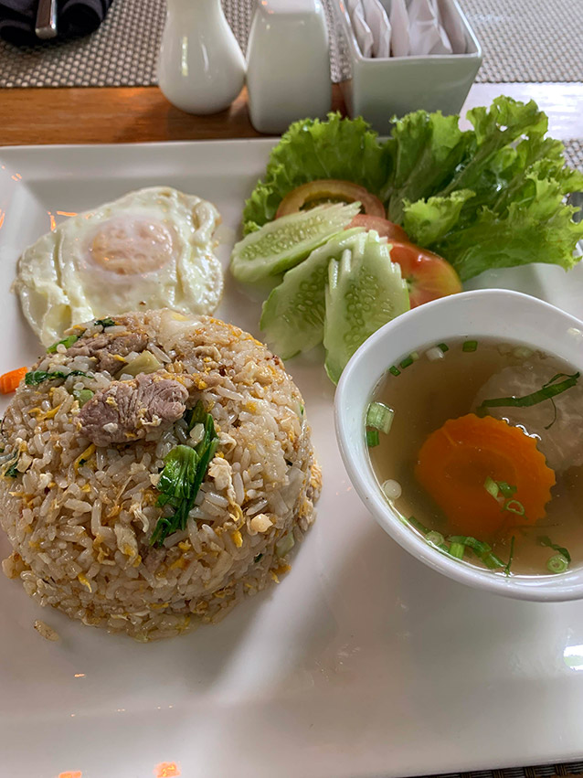
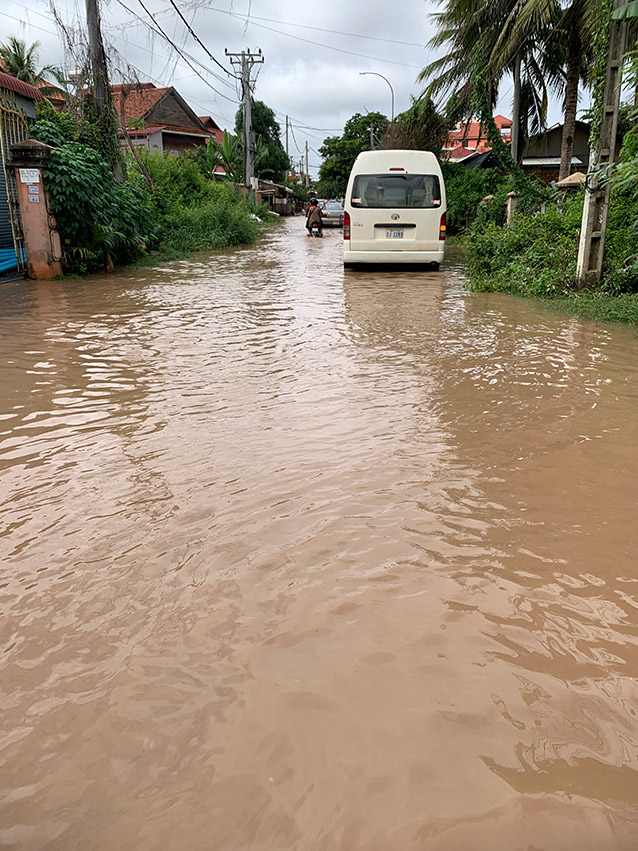
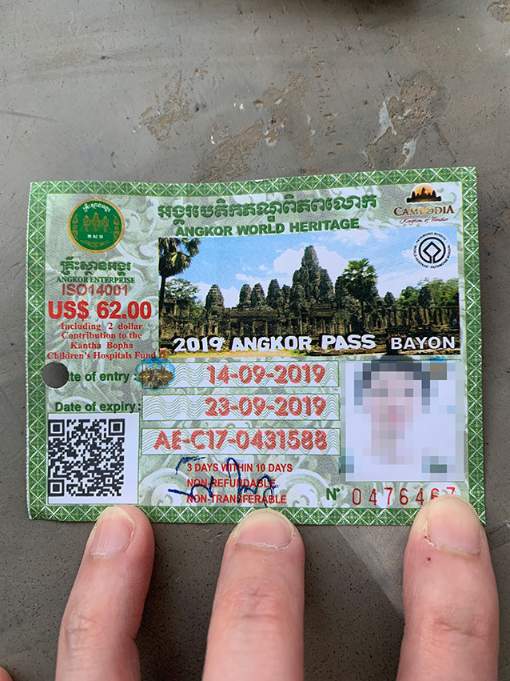

初日は移動で疲れていたこともあり夜はぐっすりと眠れた。明け方まで土砂降りだったようだけれど7時くらいには雨は落ち着きつつあった。外の様子が気になるけれどひとまずは朝ごはんを食べにホテルのレストランへ。

ご飯系とか麺系、アメリカン・ブレックファーストなど複数のメニューから選ぶことができたが、一番無難そうな Classic Fried Rice を注文。

ご飯もスープもすごく美味しかった。特にスープは優しい味で飲みやすい。タイに行った時もご飯はどこで食べても美味しかったし、アジアはどこに行ってもご飯が美味いのが良い。

朝ご飯をすませ身支度をしてから出発。ホテルのエントランスで昨夜空港まで迎えに来てくれたおじさんと偶然会った。「今日はどうするの？遺跡見に行く？」って声を掛けられた。おそらくトゥクトゥクを一日チャーターしないか？って言いたいんだろうけど、ストレートにそう言ってこない辺りが流石ホテル付きのドライバー。最初にシェムリアップの街を見てから観光をスタートしたかったのと、明日以降は電動バイクを借りようと考えていたのでその旨伝えた。おじさんから Good luck. という言葉を貰ってエントランスを後にした。

ホテルを出て2,3分ほど歩いてみると、昨夜の大雨のせいか道路は洪水状態に...

流石にこれを渡るのは辛いので、来た道を引き返して反対方向から大通りに行こうとするも反対方向も同じ洪水状態だった。水は膝下くらいの高さにまでなっていた。

トゥクトゥクを呼ぼうにもこの状態では無理そうだし、他に手もなさそうなので意を決して水の中を突き進むことに。幸い 100m もないくらいで洪水は終わっていたし、ハーフパンツにサンダルという格好だったので被害は最小限で済んだ。

この状態では流石に街の中を観光するのは厳しそうなので、計画を変更してトゥクトゥクでアンコール遺跡に入るためのチケットを買いに行くことにした。おそらく10分くらいトゥクトゥクに乗ることになるし、その道中あまりにも道路の状態が悪いようであれば今日は遠出を避けた方が安全かもしれない。

比較的道の状態が良い場所から Grab でトゥクトゥクを呼んでチケットオフィスに向かう。

道中はやや大きな水たまりがあったものの、ホテル近辺ほど酷い状態にはなっていなかった。乗っている時も雨は降っていなかったのでこれなら遠出しても大丈夫そう。

チケットオフィスに到着しチケットを購入。アンコールパスには次の3種類がある。

|有効日数|有効期限|価格|
|---|---|---|
|1日|-|37ドル|
|3日|10日以内|62ドル|
|7日|1ヶ月以内|72ドル|

ずっとアンコール遺跡を回るつもりだったので3日券を購入。クレジットカードが使えるそうなので使おうとしたが自分が所持していたカードでは決済することができず、62ドルもの現金も持っていなかった(必要な分だけ持ち歩くようにしていた)ので急遽 ATM からドルをキャッシングして支払った。

購入時に写真を撮られチケットには自分の顔が載ることになる。いい記念にはなるけど、卓上カメラで下から上に少し見上げるようなアングルで撮られることになるのでわりと酷い写りになると思う。隣でチケットを買いにきていた日本人女性もこのアングルはキツいと言っていた。
