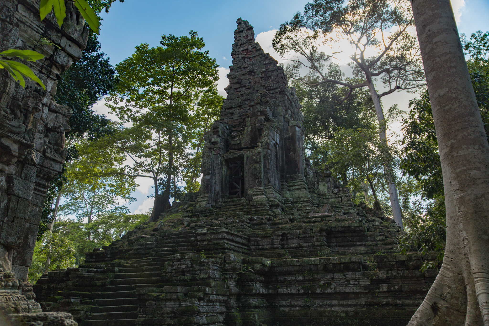

アンコールワットからアンコールトムの東側までトゥクトゥクで移動。

トゥクトゥクのドライバーさんが、アンコールトム周辺の地域は北部しか電波が入らないので観光が終わったら北の方でトゥクトゥクを呼んだ方が良いと教えてくれた。めっちゃ良い人。

アンコールトムに着いた頃には既に14時をまわっていたこともあってものすごい逆光に。

写真を撮りつつ観てまわっていると日本人の女性2人組から「写真を撮って貰えませんか？」と声を掛けられたので快く OK して撮ってあげた。たまに日本語が聞こえてくることはあったものの、カンボジア国内で日本人とコミュニケーションをとったのはこれが初めて。カンボジアに着いてまだ24時間も経っていなかったが、やはり母国語は安心感がある。

さらに奥へと進んでいくと、今度は男性2人組から「こんばんは」って声を掛けられた。明らかに日本人ではなさそうだったが、どこの国の人かまではわからなかった。年齢は二十歳前後に見えたが、もしかするとカンボジア人の国内旅行だったのかもしれない。

せっかくなので No, You have to say こんにちは. と返してあげたところ、 Oh, ありがとう. と笑いながら去っていた。

そろそろ夕方に差し掛かってきた。暗くなる前には買い出しを済ませてホテルに戻りたいところ。

Grab でトゥクトゥクが呼べそうな大きな通りに向かって歩いていると、お経のような声が聞こえてきた。声の先には寺院があり、お経を読むお坊さんが居たり瞑想する教徒に水をかけるお坊さんが居たりと、珍しい光景が広がっていたが写真を撮ってよさそうな雰囲気ではなかった。気にはなるものの、目線だけで様子を追う程度に留めて大きな通りに向った。
