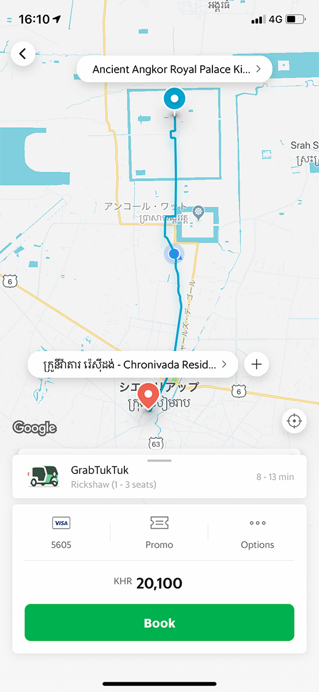

アンコールトム周辺の遺跡をすべて見終える前にすっかり夕方になってしまった。

暗くなる前にホテルに戻ろうといつものように Grab でトゥクトゥクを呼ぶ。ほんの数十メートルのところでドライバーがアサインされたので1,2分で乗車。

すると「どこに行く？」って聞かれたので、 Grab で指定してるんだけどなと思いつつ Google Map 上で指し示した。

まぁアンコールトム近辺は電波入りにくいのでその影響かなぁと思いつつも、やはり心配だったのて Grab のドライバーのアイコンを見せながら Is this you? と聞いてみたところ、 It’s me. と返ってきた。

なにやら嫌な予感はしつつもそのまま乗ってしまったのだが、これが間違いだった。

2,3分走っていると実際にアサインされた Grab ドライバーから Grab App 上で電話が掛かってきた。ｱｰ と思いながらも、こんな複雑な状況をこんな状況で説明できる自信がなかったので電話には出れず。暫くすると Grab 上での予約はキャンセルされたと通知がきてしまった。すまん、本来の Grab のドライバー。

騙されているということが確定し、きっと降りた時には料金をふっかけられるであろうことが想像できた。

ひとまずさっき Grab でトゥクトゥクを呼んだ時の画面のスクリーンショットを撮った。 Grab は予約する前に料金が確定していて、画面には 20,000 KHR (5ドル) という料金の記載があった。彼は自分が Grab のドライバーと言ったのだからこれが交渉材料になると思った。

ドライバーは乗る時に Google Map をチラッと見ただけなので当然道は良くわからない様子だった。まだ半分くらいしか進んでないのに一旦止めて道を確認してきたりした。

そもそも Google Map の見方もよくわかってなさそうで、青いアイコンが現在地であることすらよくわかってなさそうだった。なので「今我々はココにいて、ココまで真っ直ぐ行って、ここで右に曲がるんだよ」と教えると、わかったようなリアクションをして「曲がる時に声掛けてくれ」と言ってきた。たぶんまだよくわかってなさそう。

しょうがなく OK してトゥクトゥクをホテルの前まで誘導した。途中面倒だからホテルの手前でいいかぁとも思ったけど、最悪めちゃくちゃ高額な金額を要求されたらホテルの人に助けて貰おうと思っていたのでなんとしてもホテルの前まで行きたかった。

なんとかホテルの前に辿り着くと、向かった時にかかった時間の1.5倍くらいはかかっていた。トゥクトゥクを降りて改めてドライバーの顔を見てみると若い。25歳くらいだろうか。

Grab のドライバーじゃないことは既にわかってたけど、特にお金を払うことなく御礼の挨拶だけしてホテルのエントランスに向かう素振りを見せると Wait. You have to pay money. と言ってきた。

まぁそりゃそういう反応だよなと思いつつも、敢えて知らないフリをして What's? You are a Grab driver, don't you? と言ってみると Yes. と返ってきた。

さらに I'll pay by credit card. と言ってみると、今度は I'm not a Grab driver. と返ってきた。続けて You said you were a Grab driver, don't you? と言ってみると、ドライバーはもうアタフタした感じで何も言うことができなくなっていた。

なのでここでやっと話が見えたフリをした。客惹きのために嘘を付いたんだね、みたいな理解をしたつもりになって OK, I'll pay by cash. How much? って言ってみると 10 dollars. と返ってきた。

Grab に事前に表示されていた金額の2倍。想像していたよりは安い金額だったが、このままこちらが譲歩するのも悔しいので It's too expensive. と言うと、ドライバーはまたアタフタして何も言えなくなってしまった。

You are a liar. Look at this. と言って用意していた Grab App のスクリーンショットを見せ 20,000 KRH is 5 dollars. I don't have to pay more money. 5 dollars! と語気を強めに言うと、すぐに OK. と返ってきたので乗ってる間に用意していた 5 ドルをスッと渡してさっさとホテルの中へ。

すごく面倒なことになってしまったがぼったくられることは回避できた。なお、これはヤバいと思って撮った時のスクリーンショットがコチラ。

