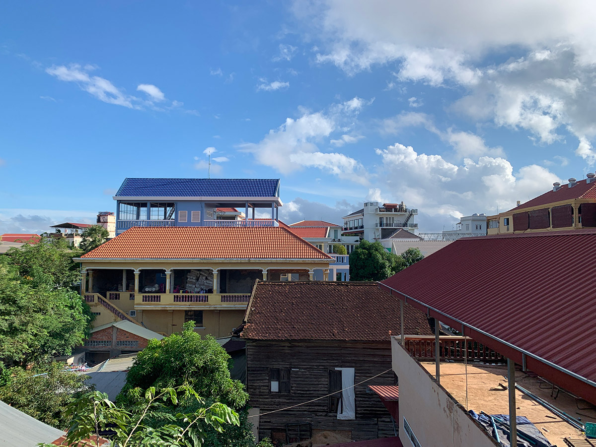
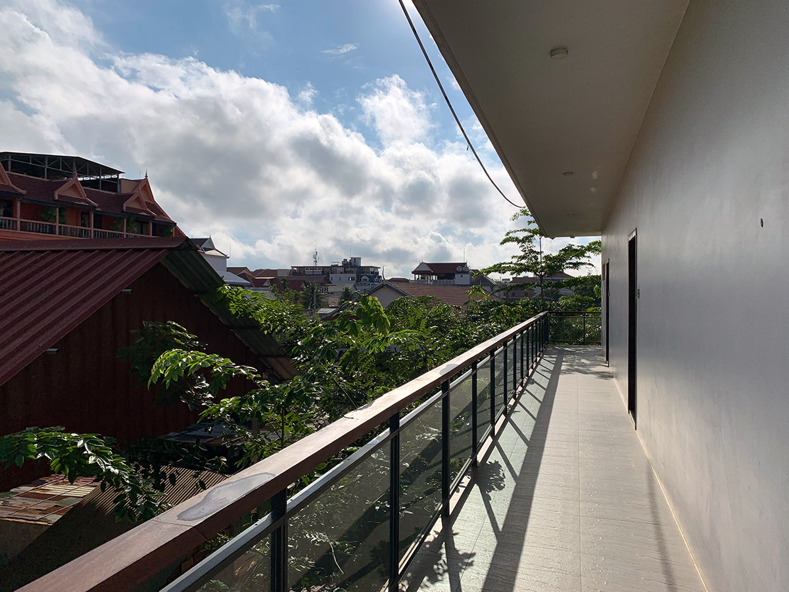
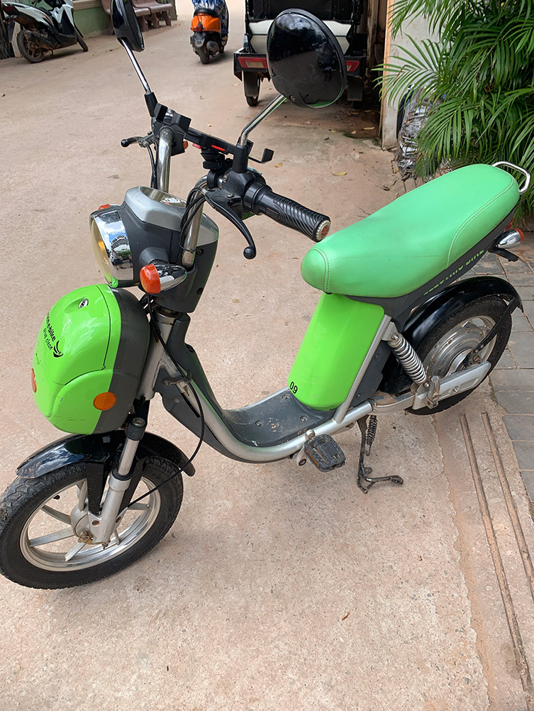

カンボジア3日目の朝は快晴。

この日は電動バイクをレンタルして昨日の観光の続きをするつもり。

事前に調べた情報によるとシェムリアップで旅行者がバイクを運転するのは違法とのことだが、電動バイクは OK らしい。カンボジアはジュネーブ条約に加盟しているので日本で国外運転免許証を取得していれば通用するはずだと思っていたのだが、ネット上で調べるシェムリアップでは違法であるとか、現地の警察官に止められたとか、なにやら危なそうな雰囲気だったので電動バイクにすることにした。

レンタルしに行ったのは [Green e-bike](http://www.greene-bike.com) というお店。

お店に入ると2人の女性店員さんが迎えてくれた。2日間レンタルしたい旨伝えると、渡してくれたマップを見ながら一緒に周遊プランを練ってくれた。

電動バイクなのでもちろんバッテリーで駆動するわけだが、1度フルチャージした状態でもアンコール遺跡群に行って戻って来れる程は走れないらしい。アンコール遺跡群の周辺にバッテリーをチャージさせてくれるポイントがいくつかあるのでそこでの充電が必須となる。それからバッテリーを長持ちさせるためにはスピードを出し過ぎないことが重要で 20km くらいで走行するのがバッテリーの持ちが良いとのこと。普通の自転車よりちょっと速いくらいかな？

料金は1日8ドルで、私の場合は2日レンタルしたので16ドルだった。なおレンタル時にパスポートをデポジットとして預ける必要がある。

店員さんがひととおりの操作方法を説明をしてくれるのだが、流暢な英語で説明をしてくれるのでとてもわかりやすかった。

すべての説明を受け終えて、バイクにスマートフォンのマウントを付けて Google Map が見れるようにしてから出発。当然道を全く知らないのでこれが無いと始まらない。

まずは昨日の続きでアンコールトム方面に向かうことにした。ちなみにカンボジアは右側通行。街の中はわりと交通量があるし、たまに逆走してくるドライバーが居たりもするので色んな意味でハラハラしながら目的地に向かう。
