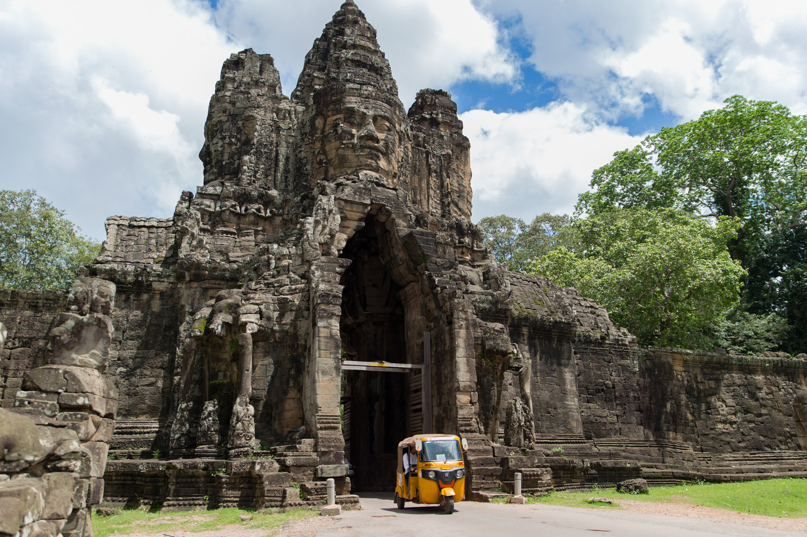
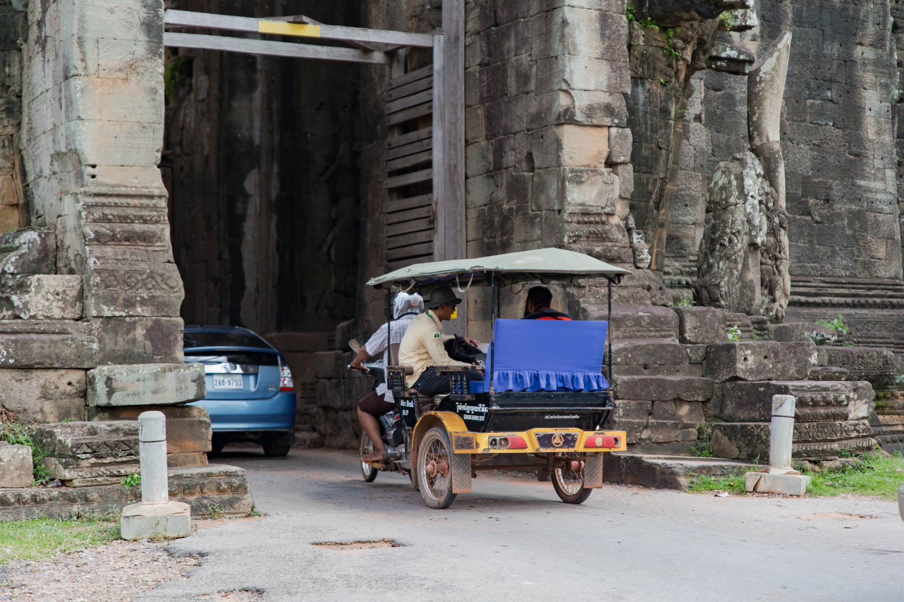
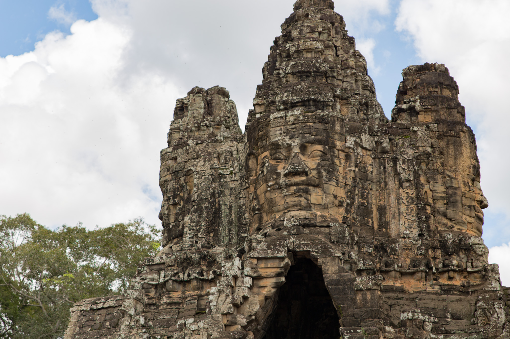
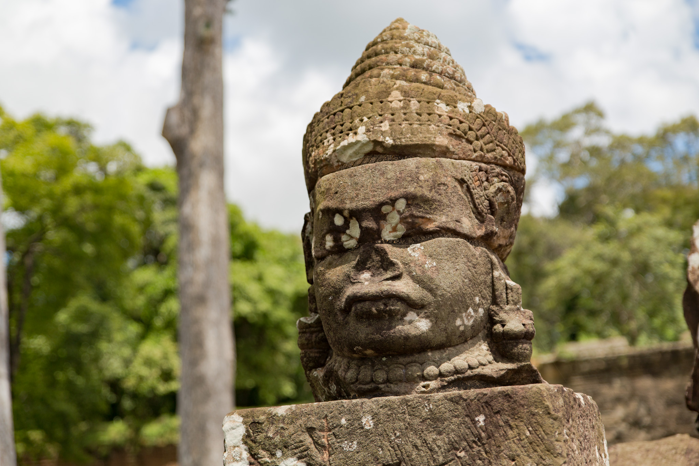
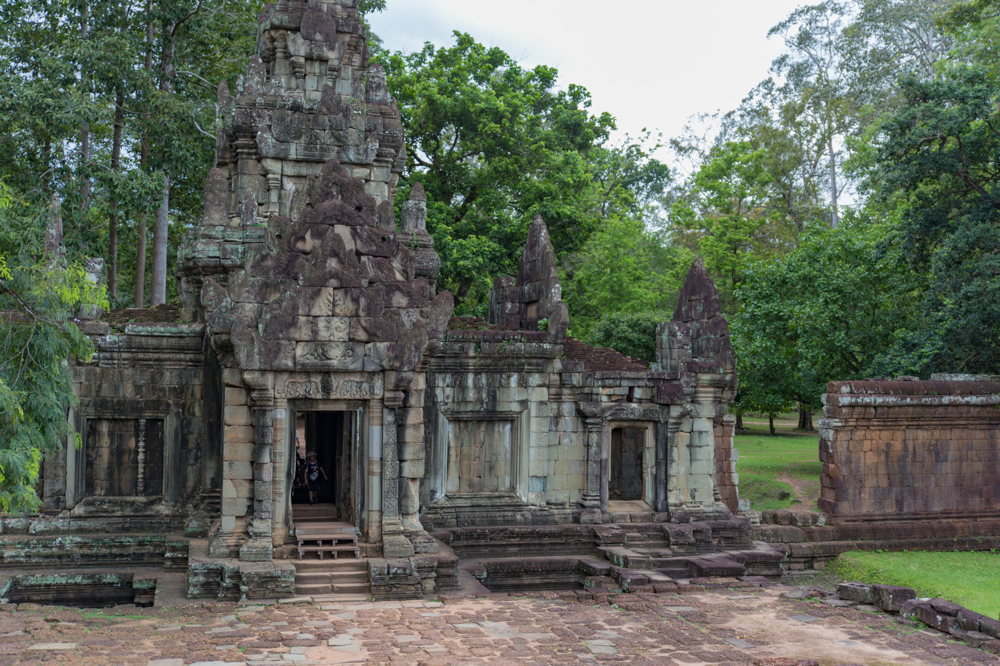
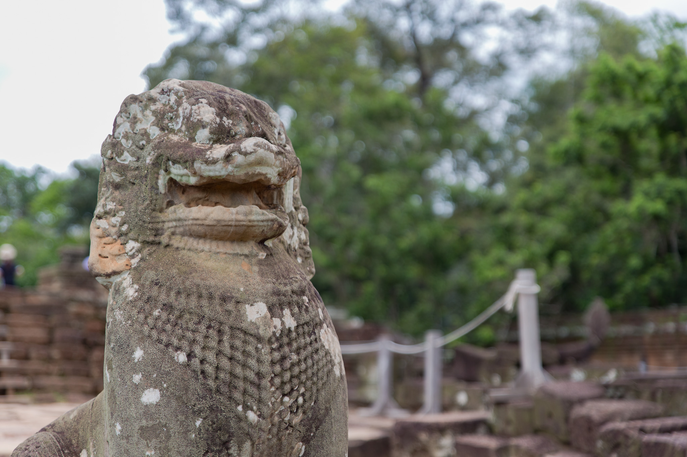
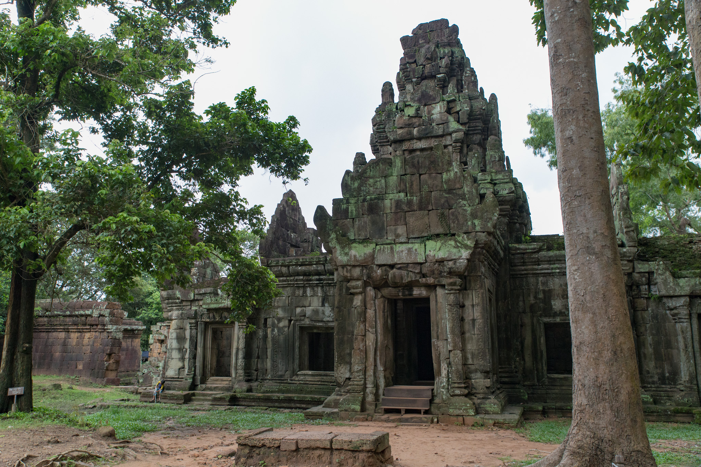
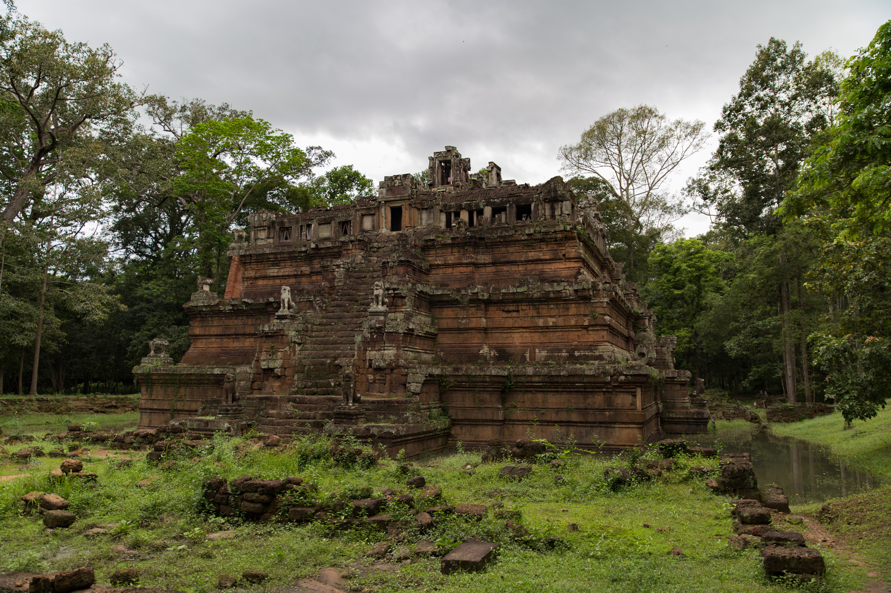
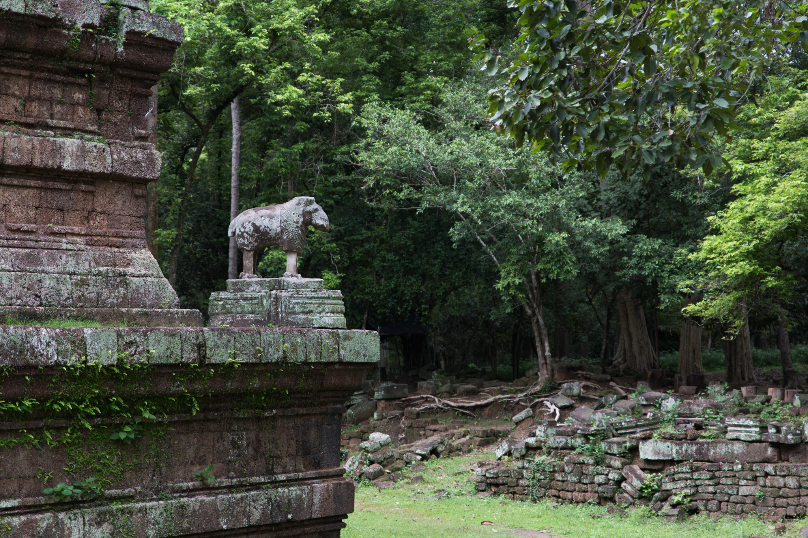

恐る恐るバイクを走らせながら、アンコールトムの南大門へ。

近くの駐車場にバイクを停める時に「ご飯食べていかない？」と呼び込みの女性から声を掛けられた。断っても「どこから来たの？」とかガンガン話しかけてくる。ひとり断ってもまたひとり。旅行者を相手にする商売も客の奪い合いで大変なんだろうな。

門の通路は結構狭くて片側一方通行。通行している車の大半はトゥクトゥクで移動する旅行者達。写真は撮らなかったけど、象の背中に乗って移動している旅行者もいた。ものすごく遅くて渋滞になってたけど。

次は象のテラス近くへ。シェムリアップ市内を離れると交通量が減って運転しやすい。

少し曇ってきている。

門をくぐってピミアナカスへ。

少し奥まった場所にある遺跡は静かに観ることができて良い。ピミアナカスを観ている時、自分以外の観光客は5,6人くらいしかいなかった。

ピミアナカスから離れると小雨がポツポツと降り始めた。ちょっと様子をみようと象のテラス近くの遺跡で雨宿りしていると、数分後には土砂降りになったが、さらに15分くらい待っていると雨はピタリと止んだ。カンボジアの天気は本当に変わりやすい。
