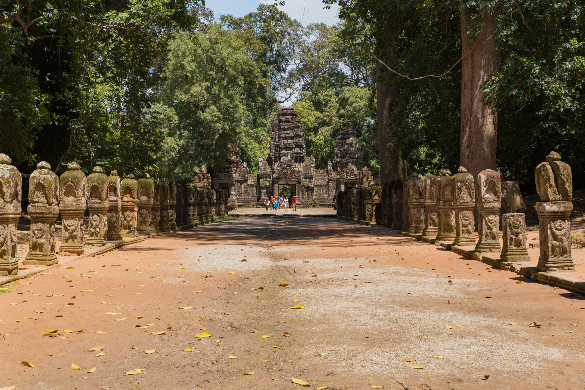
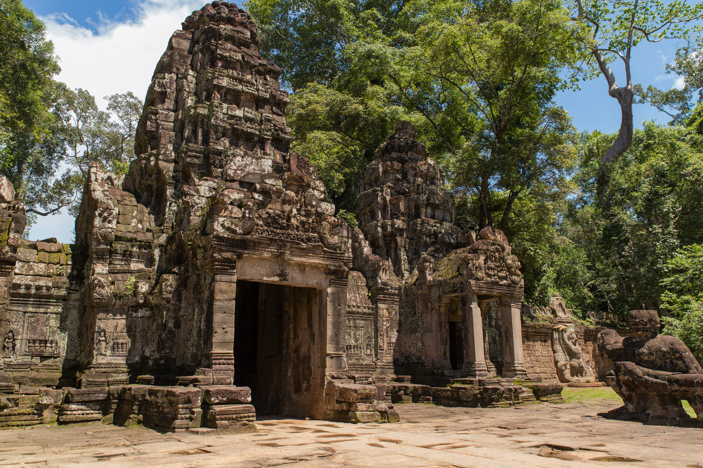
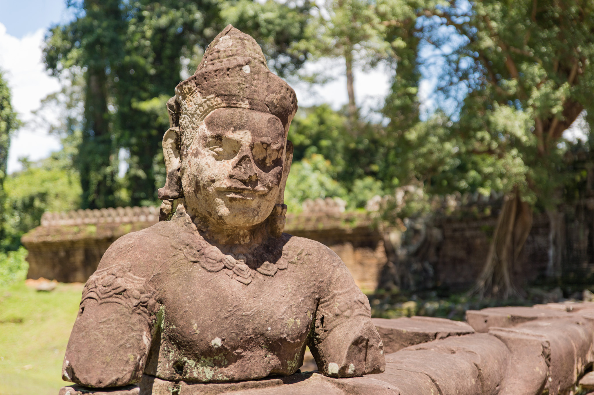
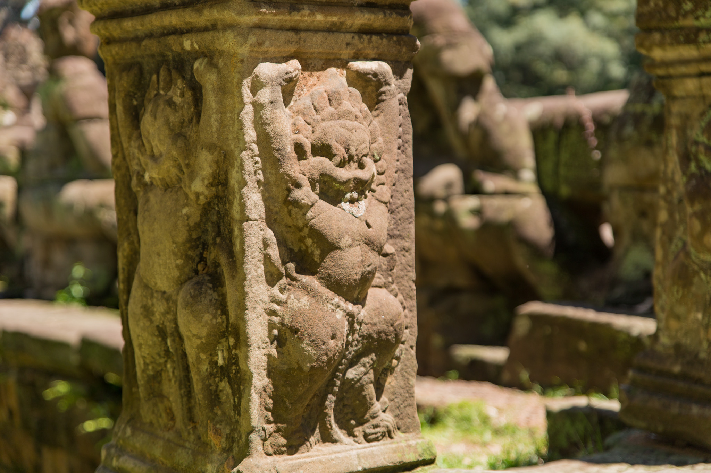
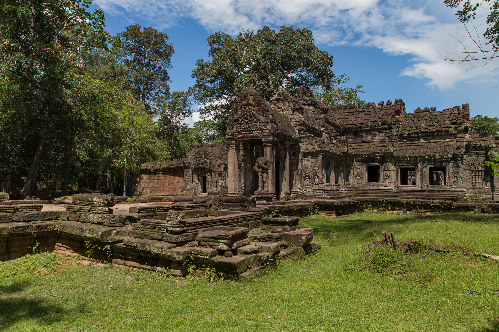
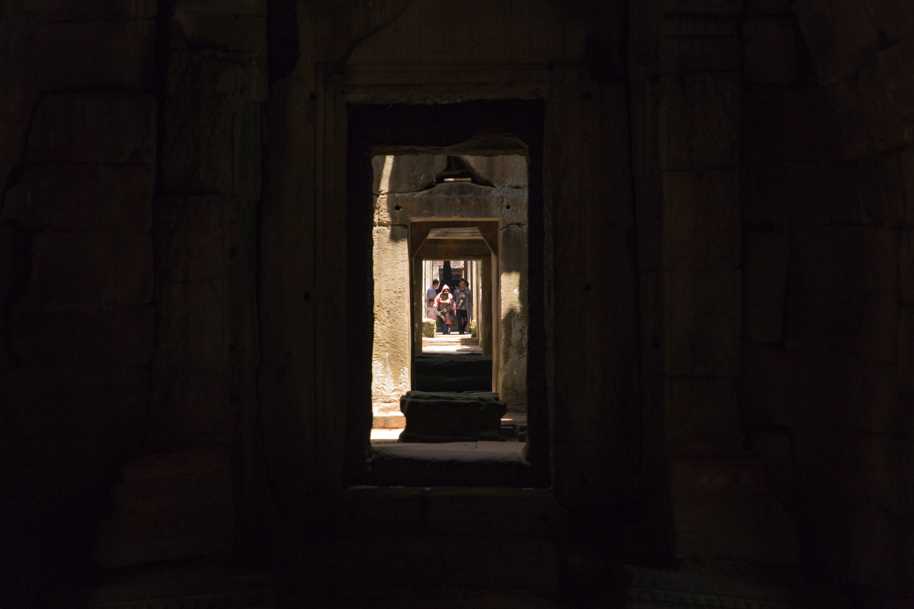
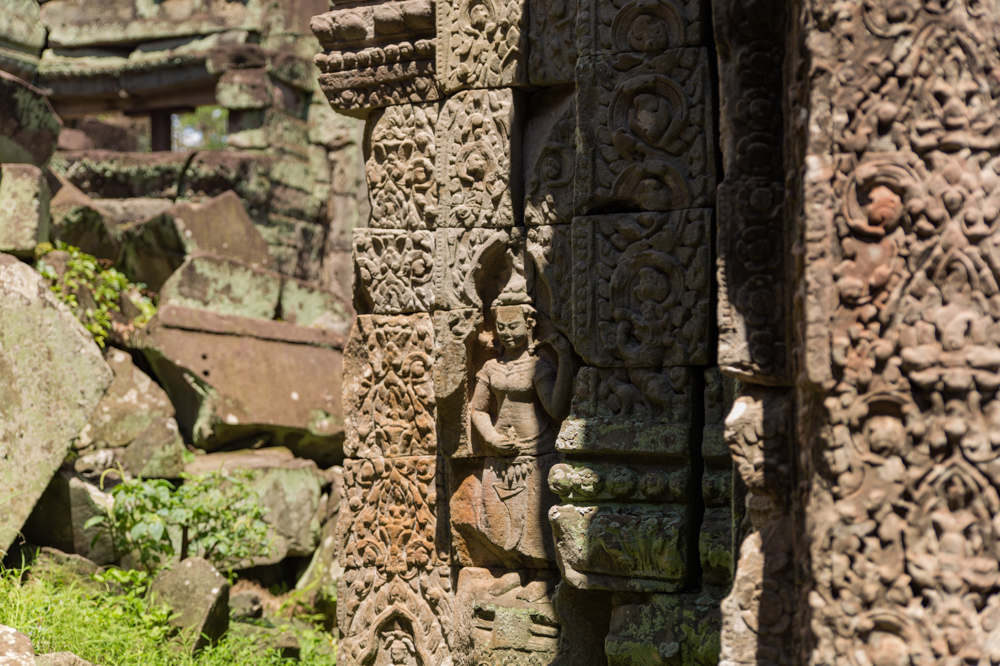
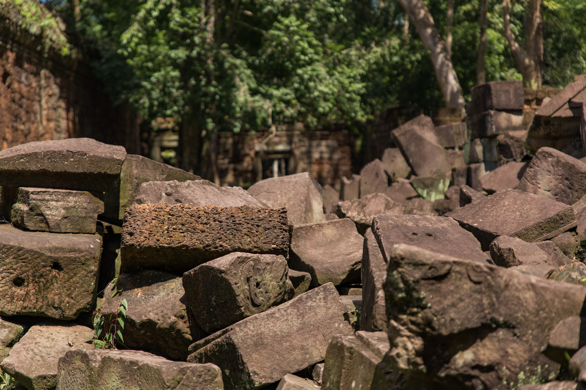
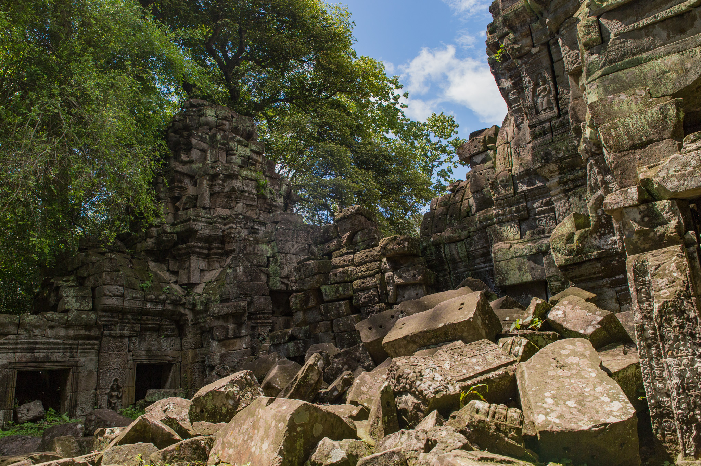
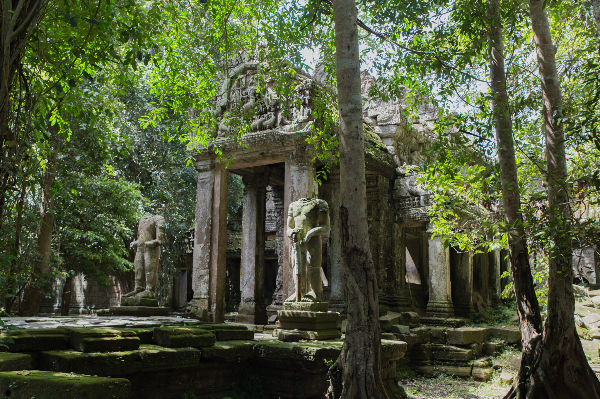

運良く雨も上がったので次はプリヤ・カーンへ。

プリヤ・カーンの入り口前のレストランに [Green-ebike](http://www.greene-bike.com/) の充電スポットがある。現地に到着するやいなや、おばさんが大きな声で「ここで充電できるよー」とアピールをしてくる。緑色でスピートの遅いバイクに外国人が乗っているのだからすぐにそれとわかるだろうな。

Green-ebike に貰ったパンフレットによると Free charge point と説明されているので多分なにも注文せずに充電するだけでも良いんだろうけど、なんだか少々申し訳ない気持ちもするので1ドルでアイスコーヒーを注文し、出掛けに1ドルのペットボトルの水を買った。

充電したままプリヤ・カーンを観光したかったので「30分くらいで戻ってくるよ」と伝えると「1時間でも2時間でも大丈夫」と言ってくれた。ネット上では料理の値段が異常に高いから気を付けろなどという情報があったような気がするが、プリヤ・カーン前のレストランのおばさんはわりと親切で良い人に見えた。

レストランを出てプリヤ・カーンへ。

そこそこ市内から離れた場所にある遺跡だが、ここは人気のあるスポットなのか観光客はまずまず多い。

ちょっと前に雨が降っていたとは思えないほどの快晴。こっちの方はそもそも降ってなかったのかな？

入り口の両脇にある柱に彫られた像はどことなく愛嬌があっていい。

奥に進んでいくと、ダンジョン感強めな遺跡がお目見え。

昼間とはいえ中は真っ暗。日が当たる場所とそうでない場所の明暗差がくっきり。

プリヤ・カーンは思っていたよりも広大な遺跡だった。奥がどこまで続いているのかここからではよくわからない。これは30分では戻れそうにない。

通路から外の様子を伺うと、彫刻された像があるかと思えば一方は瓦礫の山となってしまっている。

今にも壊れそうな場所も多い。時間の経過とともに少しずつ倒壊してしまっているのだろうか。

カメラを手にしていたからだろうか、通路を進んでいると欧米からの旅行客っぽいおじいさんとおばあさんに「写真撮るのが好きならこの奥がオススメだよ」と声を掛けられた。60代半ばくらいに見えたが、アンコール遺跡群はどこも広大で歩いて回るには体力がいる。自分も同じ年齢を迎えた頃に同じように元気でいられるだろうか。

おじいさんとおばあさんに礼を言って別れ、奥に進んでみるとたしかにそこには絵に書いたようなダンジョン感のある良い風景があった。

既にレストランを出て1時間くらい経ってしまっていたので、少し休憩を挟んでレストランに戻ることに。電動バイクのバッテリー、ちゃんと充電されているといいな。
