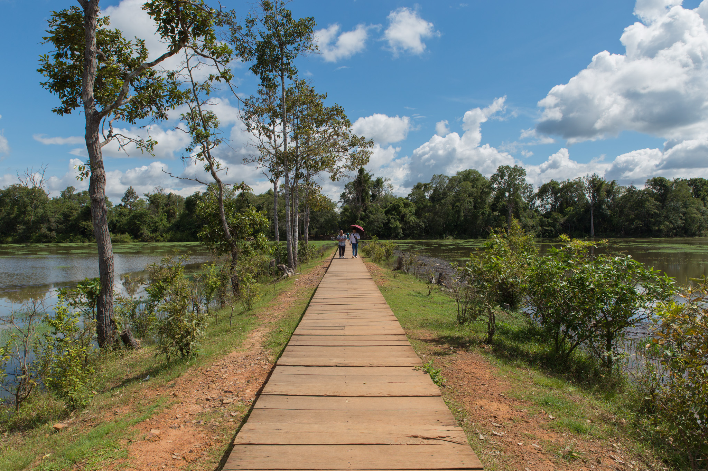
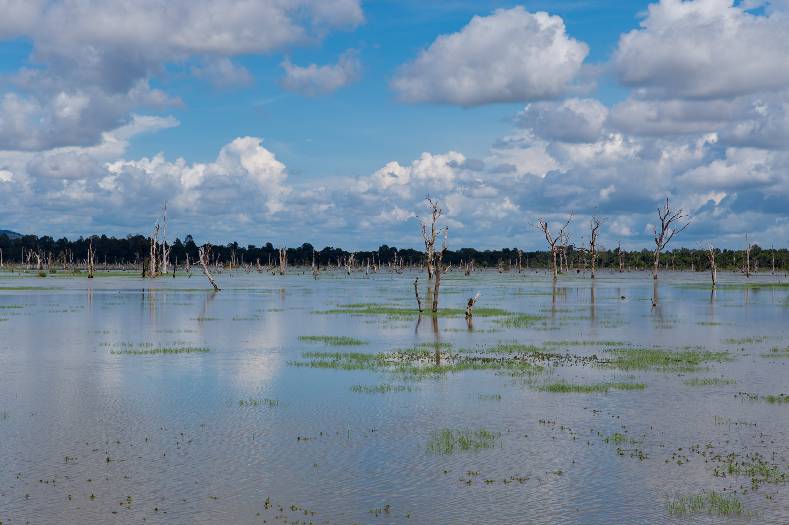
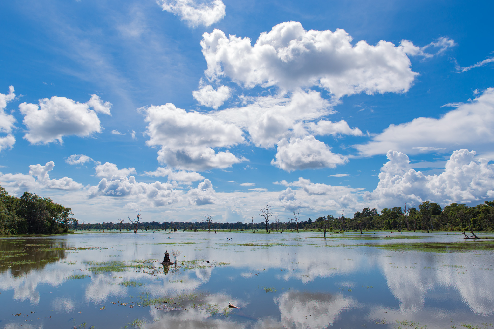
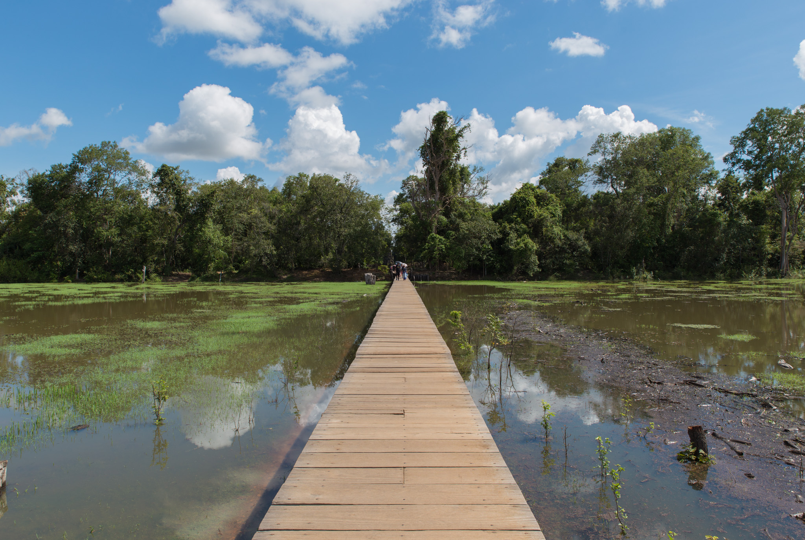

プリヤ・カーンを観光している際にレストランでバイクのバッテリーを充電させてもらっていたが、実際にバイクに乗って確認してみるといくらかバッテリーの電圧は上がっていた。充電なしではシェムリアップ市内まで帰れないという話だったので少しでも充電できたのはありがたい。

レストランのおばさんに礼を言ってニャック・ポアンへ向かう。プリヤ・カーンからみるとニャック・ポアンはお隣の遺跡みたいなもので、バイクでならほんの数分で移動することができた。

このニャック・ポアンに来た理由はこの湖に掛かった橋からの風景が観たかったから。

橋の幅は思っていたよりも狭く、3人横に並ぶのはちょっと無理かなぁという感じの広さ。バックパックを背負っている私が横向きになると背後を通れるのはひとりがやっとなので、背後に気を使う必要がある。

少し進むと湖にポツリポツリと枯れ木が立ち並ぶ不思議な風景があった。どことなく美瑛の青い池を思い出してしまうような景色。

反対の西側を向いてみる。お昼を過ぎていることもあってものすごい逆光。光を遮るものが全く無く、水面の反射も手伝ってかなり眩しい。

ここまで石造りの遺跡ばかりを観てきたので、その流れでニャック・ポアンへやってくるとギャップがあってなかなか面白い。

橋の奥には遺跡があるはずなのだが、時間の関係上そこまでは行かなかった。観たい場所が多過ぎて時間が足りない。
