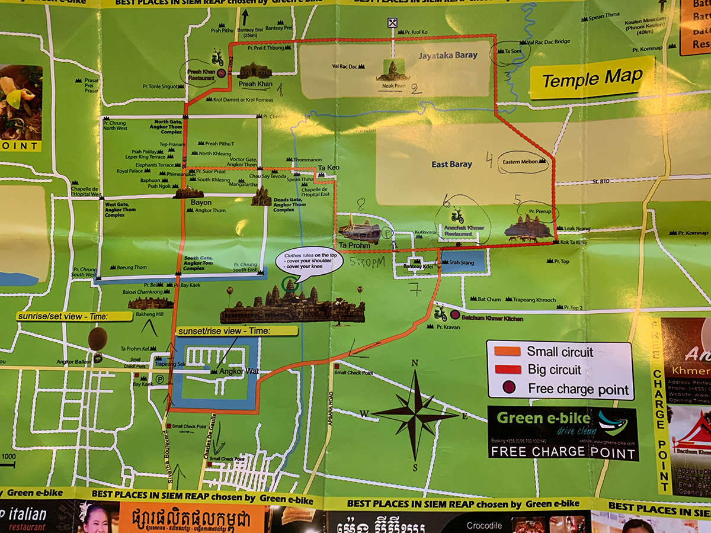
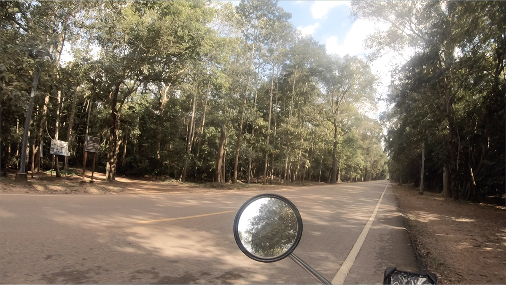
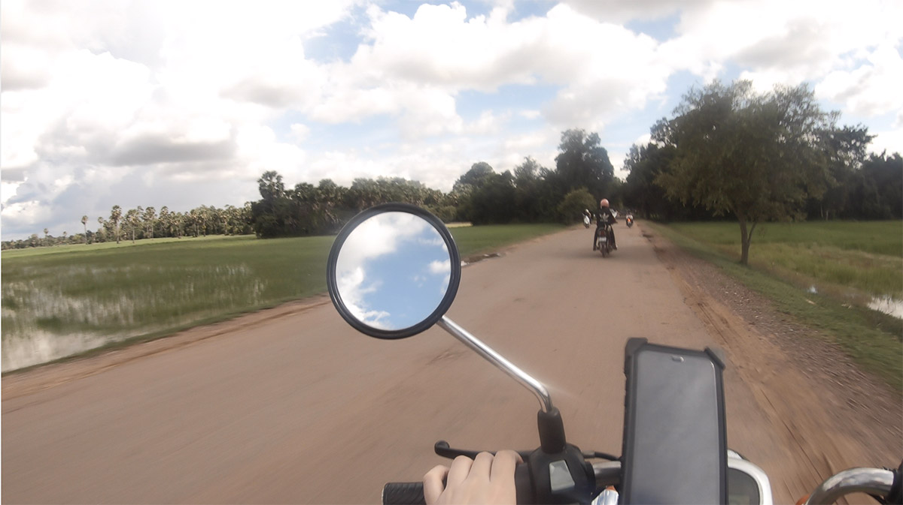
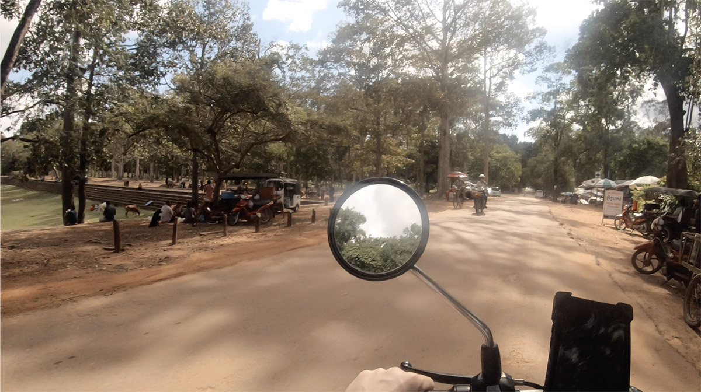
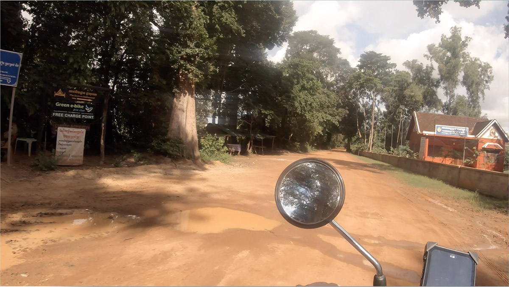
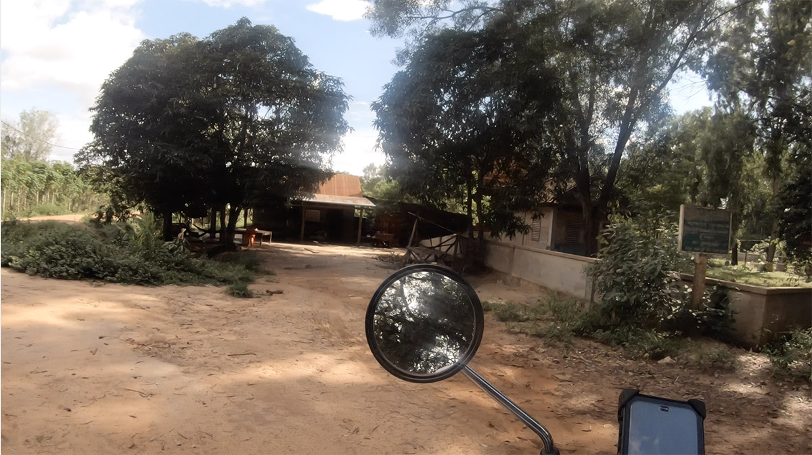
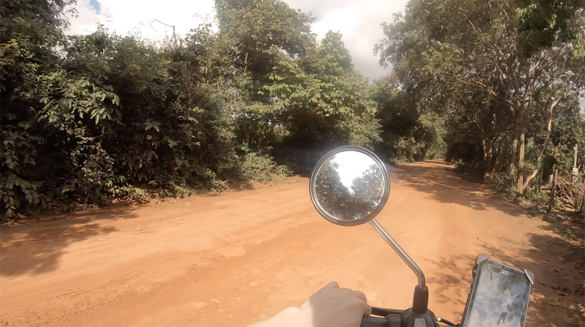
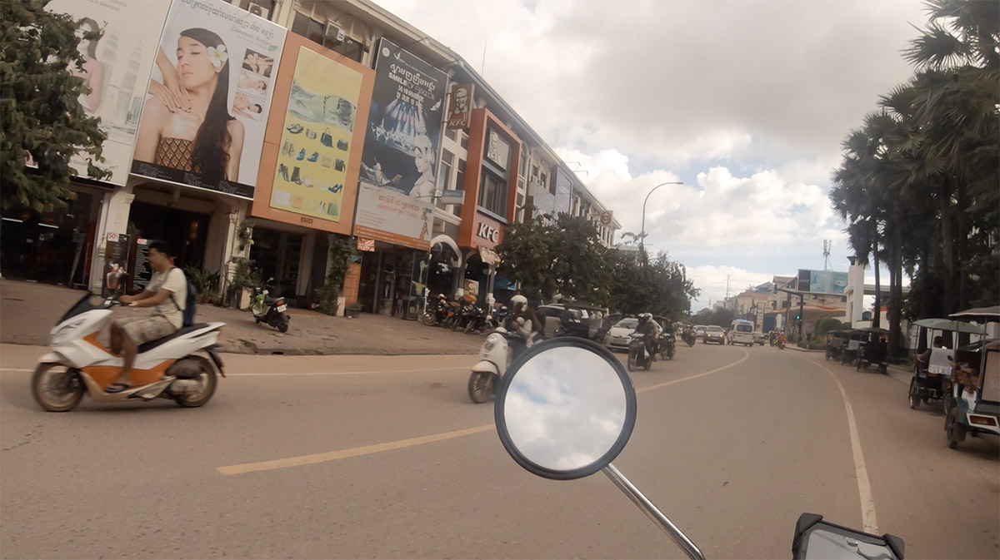
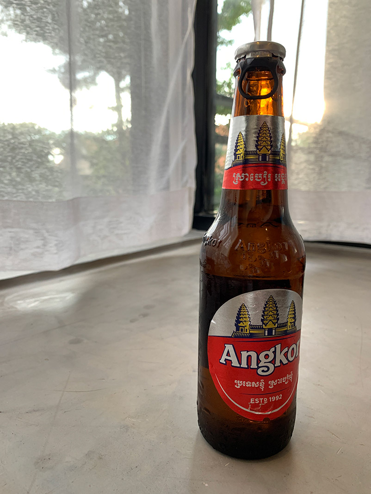

ニャック・ポアンから戻るともう15時を過ぎていた。もう1つか2つくらい遺跡を観つつバイクを充電して市内に戻ろうと、改めて  [Green ebike](http://www.greene-bike.com/) で貰った地図を眺めて計画をたてる。

マップで言うところの 6 のポイントで充電しつつ、プレループを観に行くことに決めてバイクを走らせる。この辺りまでくるとだいぶバイクの運転にも慣れてきた。

シェムリアップ市内からもかなり離れているので交通量も少ない。

道中にはこんな感じの田園風景もあって、見知らぬ土地ではあるもののなんだか懐かしいような気持ちになる。夏休み感というかなんというか。自分で運転しているという自由さも相まってとても気持ちが良い。

トゥクトゥクに乗ると「この後の予定は？よかったら1日チャーターしない？」みたいなことをよく言われたけど、だいたい「自由に好き勝手に過ごすのが好きなんだ」と言って断っていた。

実際に行ってみたら思いのほかすごく良い遺跡だった、みたいなシチュエーションで「でもトゥクトゥクのドライバーとの約束の時間だから戻らなきゃ...」みたいなことを考えたくないんだよな。

そろそろ目当てのチャージスポットの地点に到着。

スピードを落としてゆっくり進むも、すぐにはチャージスポットを見つけることができず。見落としたかな？と思って少し戻ってみたりもしたが、結局見つけることができずじまい。

うぅむ。。まぁ Green ebike から貰ったマップでいうところの 7 のポイントにもう一個チャージスポットがあるはずなので、深く考えずにそっちに向かうことにした。

メインの通りから 7 のポイントに向かうコーナーがこの写真。左に立てられた看板に Green ebike のチャージスポットの記述がある。

ほっと一安心しながら先に進むと、そこにあったのはどう見てもただの民家で、しかも家の前には鎖で繋がれていない犬が4,5匹。

いやーさすがにココじゃないだろーと思ってもっと前に進んでみるものの、暫く先には建物らしきものもないし Google Map 上ではとっくに通り過ぎているはずの場所にいた。

まさか犬がたくさんいたあの民家っぽいところなのかな？と思いつつ例の民家まで戻って恐る恐る近づいてみると、犬がものすごい勢いで吠えながらこちらに向かってくる。

絶対こんな状況では誰も寄り付かない。ここではなさそうだが他にそれらしい場所を見つけることもできなかった。

というわけでチャージスポットを見つけることができなかったわけだが、そうすると果たして残りのバッテリーでシェムリアップ市内まで戻れるかどうか一気に不安になってくる。さっきまで感じていたはずの自由さは何処へ。

一つ前のチャージスポットを探しに戻るにしてもシェムリアップ市内とは逆方向になってしまうし、そもそもさらにその分のバッテリーも消費してしまうことになる。もう夕方だし時間に余裕もない。

しばし悩んだが、バッテリーをなるべく長持ちさせるために低速で一直線にシェムリアップ市内に向かうことにした。さすがにこんな場所でバッテリー切れを起こして夜を迎えるのはマズい。

低速でシェムリアップへ向かった結果、最終的には無事にホテルに辿り着くことができたものの、その道中はバッテリーの電圧レベルを見ながら一喜一憂していたので心労がたまった。

なんとか日が沈む前にホテルに戻れたという安心感とともに飲むビールは美味かった。

しかし、わかってはいたものの電動バイクのバッテリーは死活問題になりうる。事前の調査では「チャージスポットの店が閉まっていた」みたいな話を見かけたりもしたし、電動バイクのバッテリー管理はなかなか難しい。
