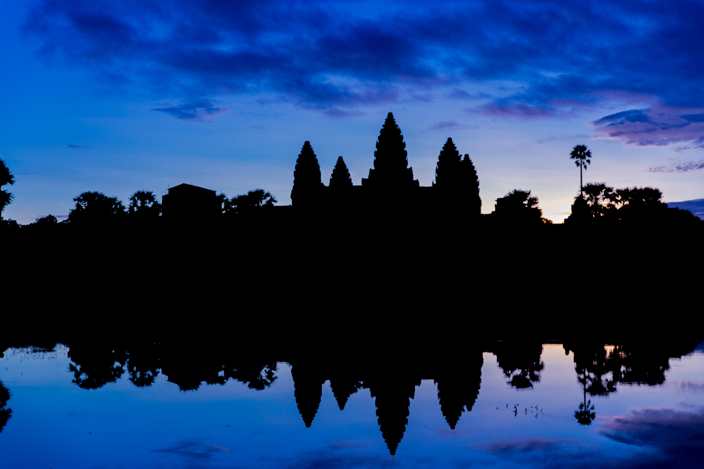
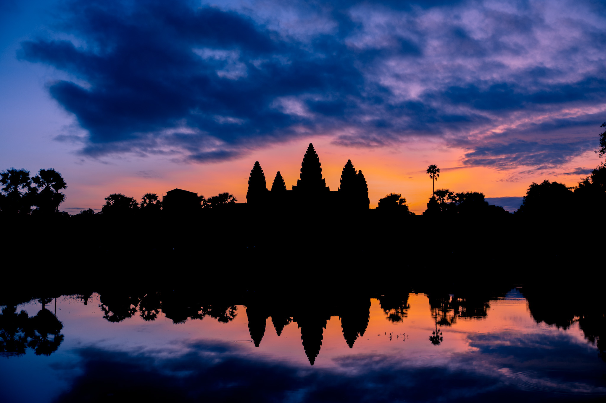
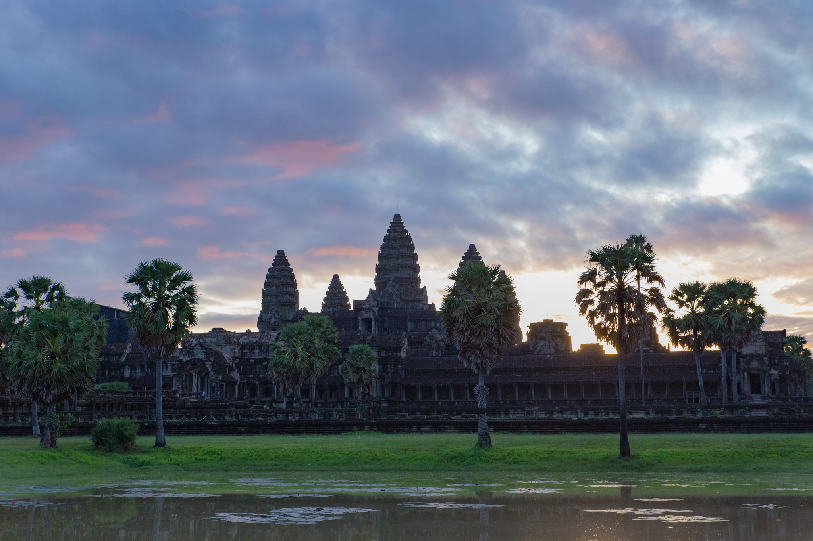
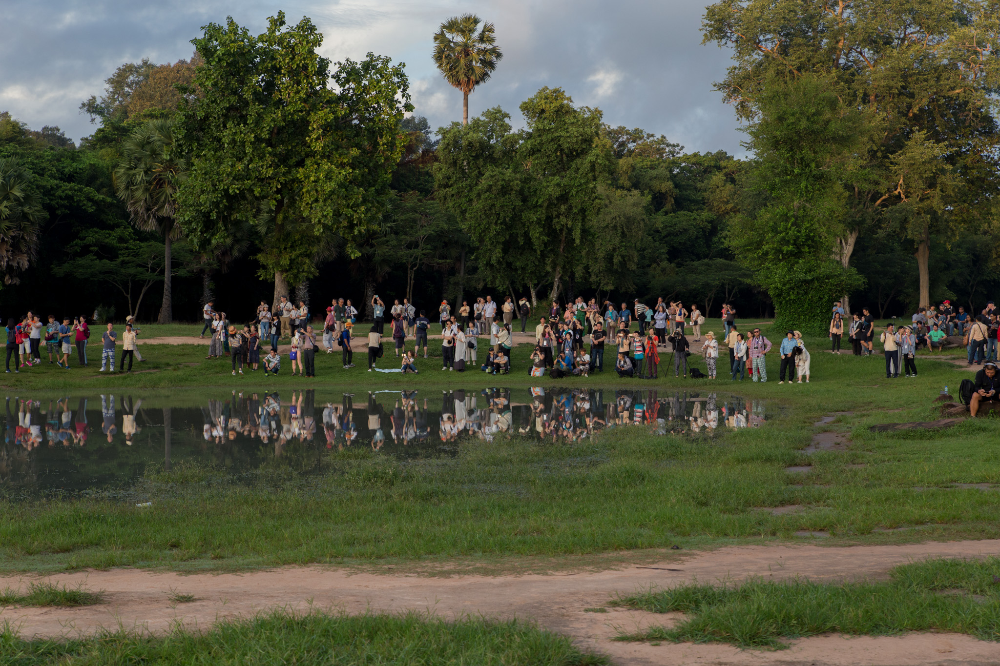
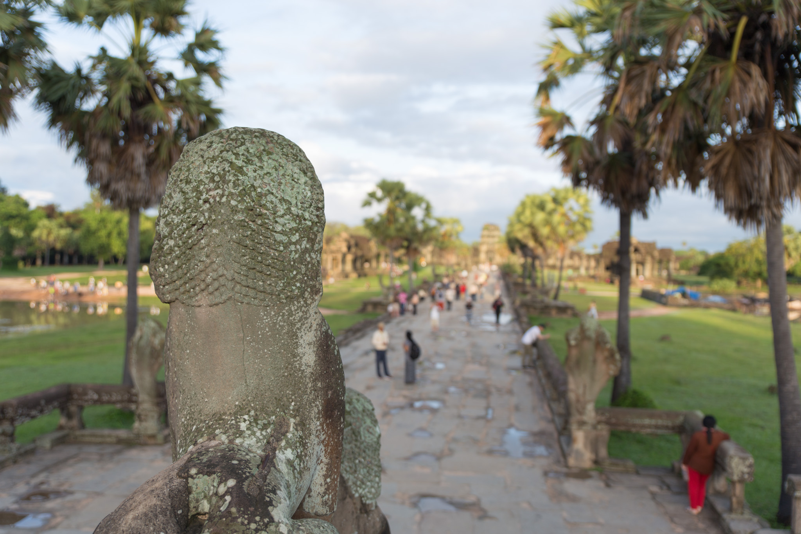
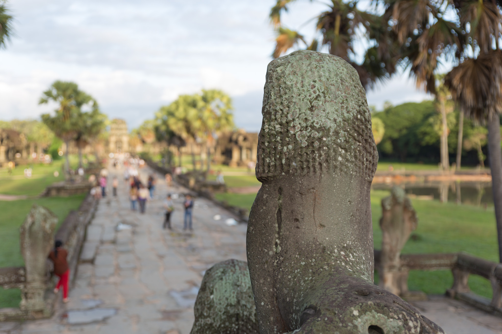
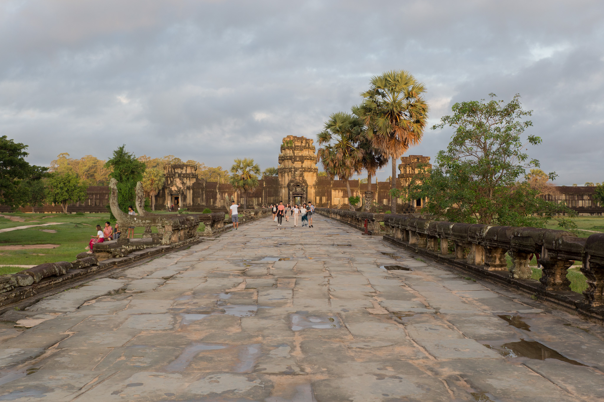
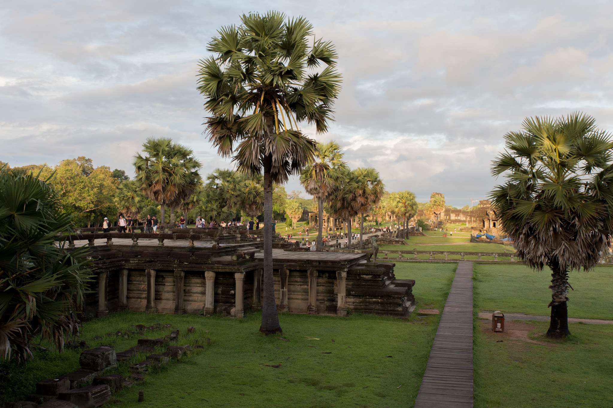

カンボジアでの最終日はアンコールワットへ日の出を見に行くことにした。

前日の天気予報によれば午前中は晴れ。朝4時起きは大変だが、カンボジア滞在最終日なので私にとってはこれがラストチャンス。

日の出の予定時刻は5時30分くらい。ホテルからアンコールワットまでの移動に20,30分くらいは掛かるので5時前にはホテルを出たい。

こんな朝早くにトゥクトゥクが捕まるかなと心配しながらいつものように Grab で呼んでみると、一瞬でドライバーがアサインされてほんの1分程でホテルの前に到着。全く心配する必要はなかった。

シェムリアップ市内からアンコールワットに向かう道中、早朝5時前であるにも関わらず自分と同じようにトゥクトゥクに乗った観光客をたくさん見かけた。中にはたくさんの観光客を乗せた大型バスも。ツアーだろうか。

途中にアンコールパスのチェックポイントがあるのだが、係員にアンコールパスを見せると Your ticket is the last today. と念を押されさらに最終日である実感が湧く。

アンコールワットの西側に到着。辺りはまだ夜明け前で真っ暗なのに観光客や現地ガイドなどたくさんの人がいた。

既に空が青くなりつつある。もう少し早めに来るべきだったかと後悔しながら足早にアンコールワットの中へ。

人気の撮影スポットは寺院の前にある2つの池の前。私が行った時は北側の池の前は柵とネットで囲われていた。修復作業中なのかもしれない。

目的地の池の前にはもう既にたくさんの人がいた。照明などは一切無いので正確にはわからないのだが、20,30人どころの人数でないことはわかった。

なんとか前が空いている場所を陣取ることができた。

周辺では[ちらほら日本語も聞こえていて、50代後半の男性が「去年は曇ってて全然見れなかったから今年は運が良い」と話す声が聞こえた。初めて来てそこそこ晴れている私は運が良い。

焼けたような空の色になる時間はとても短い。

空が赤くなり始めてから15分程まっていると周辺は一気に明るくなった。この頃にはもう一旦ホテルに戻る観光客も多い。

やっと周りが明るくなってどういう状況なのか見渡してみるとこんな状況だった。これでももう半分くらいの人は帰ってそうだったし、この池の前の撮影スポットにも同じくらいの人だかりがあった。ピーク時には200,300人くらいはいたのかもしれない。

2度目ではあるものの、せっかくなので早朝のアンコールワットも少し眺めて行くことにした。

光の加減ひとつで昼間にきた時とはまた違った印象を受ける。朝日方が優しい感じで雰囲気が良い。

昼間に来た時はものすごい人だかりだったが、流石にこの時間帯はやや空いている。少し体力が必要かもしれないが、人だかりを避けたいならアンコールワットは朝日を見てからそのまま寺院の内部も観光してしまった方が良いのかもしれない。
